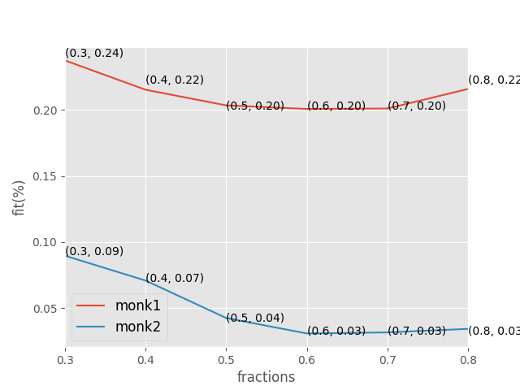

# DD2431 Machine Learning - Lab 1: Decision Trees

### Yamada Jun and Philipson Samuel

##General Information
MONK-3 has 5% noise in a training data

#### MONK-1

$(a1 = a2) \vee (a5 = 1)$

#### MONK-2

$(a_{i}=1$ , for exactly two $i=${$1..6$}

#### MONK-3

$((a5=1) \wedge (a4=1))\vee((a5 \neq 4) \wedge (a2 \neq 3))$

## Assignment 0

### Monk-2
True Concept:
$$a_{i} = 1\phantom{1} for\phantom{1} exactly\phantom{1} two\phantom{1} i \in \{1,2,...,6\}$$

Since we have 2 distinct attributes from 6 that must take the same value, and no other attribute are allowed to take those values at the same time, the created decision tree will be quite deep. Since attribute $a_{x}$ and $a_{y}$ can be any distinct attribute from $a_{i},i=\{1,2,3,4,5,6\}$, that means that we have to check at all attributes to be certain that a element is false in the worst case(one attribute is 1 so we need to check if there is another one with the same value)

\newpage

##Assignment 1

The entropy for the datasets are as follows:

| Dataset | Entropy |
|:--------|--------:|
|monk-1   | 1.0000  |
|monk-2   | 0.9571  |
|monk-3   | 0.9998  |

##Assignment 2

### Uniform Distribution

A _uniform distribution_ maximizes the entropy of the dataset, because the corresponding variables have the same probability making it hard to predict specific events.
Suppose that we have $P(X=x_{n}) = \frac{1}{N}$ where X takes the value  $X=[x_{1}, x{2},....,x_{N}]$(N={1.....}).
Then the entropy would be

$$
Entropy(S) = - \Sigma_{n=1}^{N} P(X=x_{n}) log_{2}P(x=x_{n}) = - \Sigma_{n=1}^{N} \frac{1}{N} log_{2} \frac{1}{N} = N \times \frac{1}{N} log_{2} N = log_{2}N
$$

### Non-Uniform Distribution
The entropy of a _non-uniform distribution_ is smaller than the entropy of a _uniform distribution_ since some events have a higher probability than other events. Therefore it gets easier to predict what events are more likely to happen.

### High And Low Entropy Distributions
Suppose that we have a normal distribution, the form of entropy is $\frac{1}{2} ln(2\sigma^{2} \pi e)$. When $\sigma = 5$, the entropy gets large because the shape of the distribution flattens out, making it difficult to predict which event's more likely to happen.
On the other hands, when $\sigma = 0.2$, the entropy gets low, because events around the center of distribution has a higher probability than the ones farther away from the center.

## Assignment 3

Since we want to maximize information gain for each step, we choose the next node splitting attribute by estimating which attribute maximizes the gain for that node.
In our case, for Monk1 it would be __A5__, Monk2 __A5__ and for Monk3 __A2__.

### Expected Information gain
|Dataset|A1|A2|A3|A4|A5|A6|
|-|-|-|-|-|-|-|
|Monk1|0.07527|0.00583|0.00470|0.02631|0.28703|0.00075|
|Monk2|0.00375|0.00245|0.00105|0.01566|0.01727|0.00624|
|Monk3|0.00712|0.29373|0.00083|0.00289|0.25591|0.00707|

## Assignment 4
The entropy implies the measure of uncertainty or unpredictability, i.e the larger the entropy is, the more uncertain an attribute has. So the maximized information gain is derived from the most certain attribute(the smallest entropy). Meaning that for the subset $S_{k}$ the entropy should be minimized.
Therefore, to create an efficient decision tree we should prune from the attribute that would result in the most pure subset. Since

## Assignment 5
|Dataset|$E_{train}$|$E_{test}$|
|-|-|-|
|Monk-1| 1.0000| 0.8287|
|Monk-2| 1.0000| 0.6921|
|Monk-3| 1.0000| 0.9444|

It seems as if the classification of dataset Monk2 was the hardest, which matches our assumptions from assignment 0. It makes sense that the training data is getting a better precision since they are what the decision trees are built upon. While it is possible that the decision trees have been overfitted to some extent, that will be seen more accurately when compared to pruned trees. The difference between the train and test datasets can be explained with how good of an example of real cases that the training data is.
\newpage

## Assignment 6
The variance in decision trees depends on the depth of decision tree, and is controlled with pruning. The decision tree before pruning has high variance and if pruning gives better results, would be overfitted. So we should always try to prune the decision tree in order to decrease the variance and increase the bias, as the chances of getting worse results are low.

## Assignment 7

We iterated the computation of the classification error for each the parameter fraction 100 times, then calculated the mean error and variance from those values. This was done to lessen the impact of single bad training runs.

As for Monk-1 the fitness achieves a maximum fitness value when we split the training data into 0.6 training data and 0.4 validation data and for Monk-2 when splitting the training data into 0.7 training data and 0.3 validation data.

According to the variance of both datasets, the changes of Monk-3 training datasets is more effective than the changes of Monk-1. Moreover Monk-3 dataset is more flexible to interpret the test data.(because Monk-3 has 5% additional noise, the variance would be bigger and test data is interpreted more flexibly)

|Dataset|$E_{pruned}$|$E_{non-pruned}$|variance|
|-|-|-|-|
|Monk-1| 0.1989| 0.1713|0.0015|
|Monk-3| 0.0335| 0.0556|0.0007|

